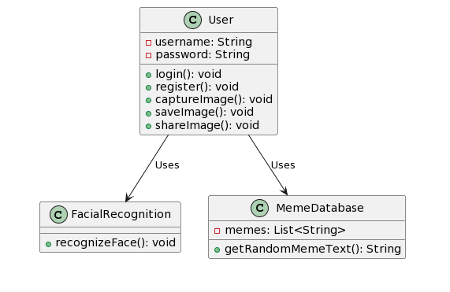

# Project Proposal: Meme Face Filter Mobile App

## Overview of Project (1.00 mark)

Our project aims to develop a mobile application using Flutter, offering a unique and entertaining experience to users. The app will leverage facial recognition technology to overlay random popular meme text onto users' faces, transforming ordinary selfies into hilarious memes.

## List of Group Members and Their Responsibilities (1.00 mark)

- Haider Bajwa: Project Manager and Lead Developer
- Fahad Fauzan: Database Integration, Backend Development, and UI Design

## List of Features and Functional Requirements (2.00 marks)

### Functional Requirements:

1. **User Registration and Authentication**: Users can create accounts and log in securely to access the app.

2. **Facial Recognition**: The app will utilize facial recognition to identify a user's face in real-time.

3. **Meme Database Integration**: Connect the app to a database containing a vast collection of popular meme text.

4. **Random Meme Selection**: The app will randomly select meme text to overlay on the user's face.

5. **Image Capture**: Allow users to capture pictures with the selected meme text overlay.

6. **Image Sharing**: Enable users to share their meme-enhanced pictures on social media platforms.

7. **Save and Share Functionality**: Users can save meme images to their device and share them later.

### Non-Functional Requirements:

- **Performance**: The app should provide a seamless and responsive experience.
- **Scalability**: Ensure that the app can accommodate a growing meme database.
- **Security**: Implement robust security measures to protect user data and privacy.

## Code Design (2.00 marks)

Our code design will follow best practices and maintainable code structure. We will use UML diagrams to represent the system's architecture, class relationships, and component interactions. The design will encompass the frontend, backend, and database components.

## Mockup of User Interface (2.00 marks)

We will provide a detailed mockup of the user interface to illustrate the user experience. The UI will feature:

- A user-friendly login and registration screen.
- A camera view with real-time facial recognition.
- A display area for the selected meme text overlay.
- A capture button for taking pictures.
- Sharing options for social media and saving meme-enhanced images.

## Writing Quality (1.00 mark)

We will maintain clear and concise documentation throughout the development process. This includes well-structured code comments, a comprehensive README file, and user documentation for the app.

## Scope of Project (1.00 mark)

The scope of our project is reasonable for the number of group members. We aim to complete all the outlined features within the provided timeframe.

